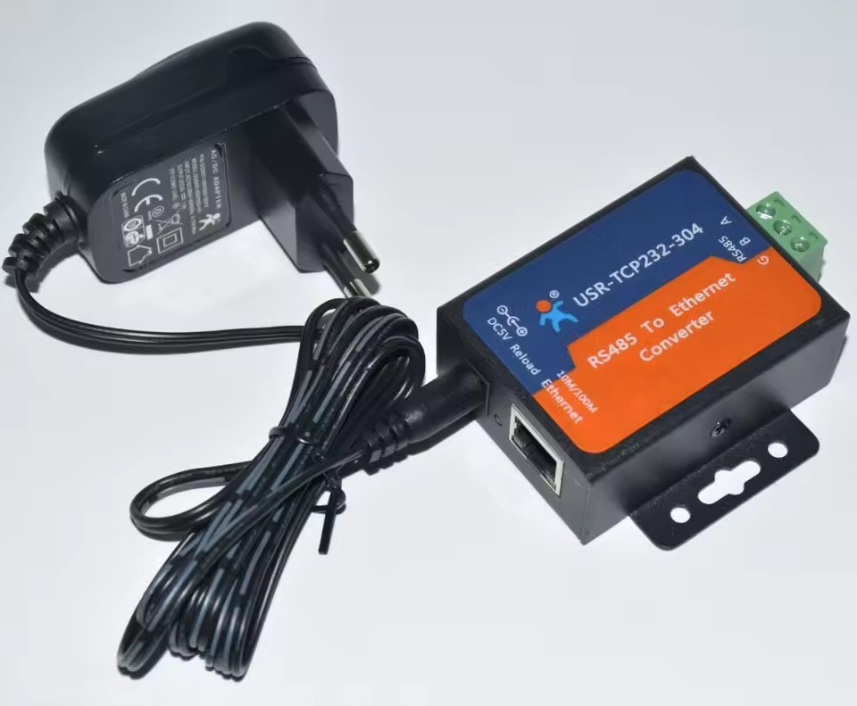
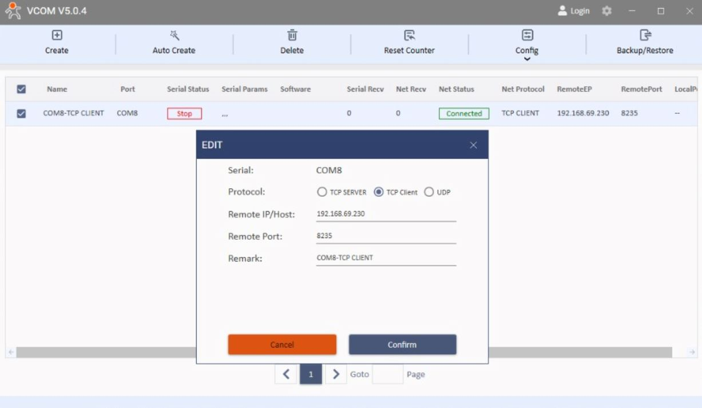
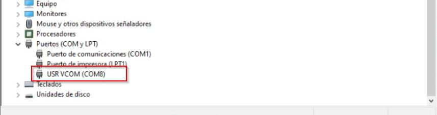

# Modbus Web UI for Huawei ESM-48150B1 Battery


 <!-- Cambia MIT por tu licencia real -->
## Introducción

Este proyecto proporciona una interfaz de usuario web (construida con Flask y JavaScript) para comunicarse con dispositivos Modbus RTU, con un enfoque **específico en la batería de litio Huawei ESM-48150B1**. Permite realizar operaciones Modbus estándar y, lo que es más importante, implementa la **secuencia de autenticación y la función personalizada (FC41)** requeridas para leer información detallada de esta batería específica.

La aplicación web ofrece:
*   Conexión y desconexión al puerto serie.
*   Lectura y escritura de registros Modbus estándar (Holding, Input, Coils, Discrete).
*   Un **Dashboard** para visualizar en tiempo real los datos clave de la batería (Voltaje, Corriente, SOC, SOH, Estado).
*   Funcionalidad para **leer la información extendida del dispositivo** (Modelo, S/N, Fabricante, Fecha Fab., etc.) utilizando la secuencia de autenticación y FC41 propietaria de Huawei.
*   Una **consola web** para visualizar los mensajes de depuración del backend.

## Motivación

La comunicación con la batería Huawei ESM-48150B1 presenta desafíos más allá del protocolo Modbus RTU estándar. Para acceder a información detallada del dispositivo (como el número de serie, fabricante, etc.), se requiere:

1.  Una **secuencia de autenticación** específica de 3 pasos.
2.  El uso de una **función Modbus personalizada (Código de Función 41)**.

Este proyecto nació de la necesidad de implementar esta lógica compleja y proporcionar una herramienta fácil de usar para interactuar con estas baterías, basándose en el análisis de la comunicación real (ver archivos `trafico Fase 1.txt`, `loguin.py`, `informe1.html`, `informe2.html`).

## Características Principales

*   **Interfaz Web Intuitiva:** Controla y monitorea el dispositivo Modbus desde tu navegador.
*   **Conectividad Modbus RTU:** Conexión a través de puertos serie (COM).
*   **Operaciones Modbus Estándar:** Soporte para lectura/escritura de Coils, Discrete Inputs, Holding Registers, Input Registers.
*   **Soporte Específico Huawei ESM-48150B1:**
    *   Implementación de la **secuencia de autenticación de 3 pasos**.
    *   Soporte para la **lectura de información del dispositivo mediante FC41**.
    *   Validación del fabricante para asegurar la compatibilidad.
*   **Dashboard de Batería:** Visualización en tiempo real de Voltaje, Corriente, SOC, SOH y Estado.
    *   Actualización manual y monitoreo periódico.
    *   Indicadores visuales de estado (Cargando, Descargando, Inactivo).
*   **Visualización de Datos:**
    *   Resultados de lectura en formato JSON crudo.
    *   Tabla detallada con interpretación de registros conocidos de la batería Huawei.
*   **Consola de Depuración Web:** Muestra los logs (`print`) del backend para facilitar el seguimiento y la depuración.
*   **Backend Flask:** Servidor web ligero y eficiente.
*   **Comunicación Asíncrona Frontend-Backend:** Uso de `fetch` para interactuar con la API REST del backend.

## Dispositivo Objetivo

Este proyecto está diseñado y probado específicamente para la batería:

*   **Fabricante:** Huawei
*   **Modelo:** ESM-48150B1
*   **ID Esclavo Modbus Típico:** 217 (0xD9)

*Aunque las funciones Modbus estándar podrían funcionar con otros dispositivos, la autenticación, la lectura FC41 y el dashboard están hechos a medida para este modelo.*

## Secencia de Autnticacin y FC41 (Huawei)

La comunicación con la función personalizada `FC41` de Huawei **requiere** una secuencia de autorización previa. Sin esta secuencia, el dispositivo responderá con un error Modbus (`0xC1`).

*(Consulta `modbus_app/device_info.py` y `loguin.py` para la implementación detallada y los informes HTML para el análisis de ingenieria inversa. ).*

## Pila Tecnológica

*   **Backend:**
    *   Python 3.12.5
    *   Flask (Microframework web)
    *   Pymodbus (Librería Modbus)
*   **Frontend:**
    *   HTML5
    *   CSS3
    *   JavaScript (Vanilla JS)
*   **Protocolo:** Modbus RTU (sobre conexión serie)

## Estructura del Proyecto

<pre>
.
├── app.py                      # Aplicación principal Flask y endpoints API
├── modbus_app/                 # Paquete con la lógica Modbus y específica del dispositivo
│   ├── __init__.py
│   ├── client.py               # Gestión del cliente Modbus (conexión, desconexión, estado, wake-up)
│   ├── operations.py           # Lógica para operaciones Modbus estándar (lectura/escritura)
│   ├── device_info.py          # Lógica específica Huawei: Autenticación, lectura FC41, parsing, caché
│   └── custom_requests.py      # Definición de clases Pymodbus para FC41
├── static/                     # Archivos estáticos para el frontend
│   ├── css/
│   │   └── style.css           # Estilos CSS
│   └── js/
│       ├── main.js             # Lógica principal del frontend
│       ├── dashboard.js        # Lógica específica del dashboard de batería
│       ├── console.js          # Lógica para la consola web
│       └── modbusApi.js        # Funciones helper para llamadas a la API Flask
├── templates/                  # Plantillas HTML (Flask)
│   └── index.html              # Página principal de la interfaz web
├── requirements.txt            # Dependencias de Python (¡DEBES CREAR ESTE ARCHIVO!)
├── loguin.py                   # Script de prueba/referencia (usa pyserial)
├── trafico Fase 1.txt          # Captura de tráfico Modbus RTU sobre TCP (análisis)
├── informe1.html               # Informe de análisis de tráfico (Detalle FC03 y FC41)
├── informe2.html               # Informe de análisis (Enfoque en secuencia de autenticación)
└── README.md                   # Este archivo
</pre>

## Configuración e Instalación

**Requisitos Previos:**

*   **Python 3.12.5:** Descargar desde [python.org](https://www.python.org/downloads/release/python-3125/). Asegúrate de añadir Python al PATH durante la instalación.
*   **Git:** Para clonar el repositorio.
*   **Puerto Serie:** Un puerto COM disponible (físico, USB-a-Serie, o virtual a través de convertidor Serie-a-Ethernet) conectado al dispositivo Modbus RTU (Batería Huawei).
*   **Sistema Operativo:** Desarrollado principalmente en Windows. Linux/macOS podrían requerir ajustes en la gestión del puerto serie (nombres como `/dev/ttyUSB0` o `/dev/tty.usbserial-XXXX`) y activación del entorno virtual.

**Pasos:**

1.  **Clonar el Repositorio:**
    ```bash
    git clone https://github.com/tu-usuario/tu-repo.git
    cd tu-repo
    ```
    *(Reemplaza `https://github.com/tu-usuario/tu-repo.git` con la URL real)*

2.  **Crear Archivo `requirements.txt`:**
    Crea un archivo llamado `requirements.txt` en la raíz del proyecto con el siguiente contenido (ajusta las versiones si es necesario, especialmente `pymodbus`):
    ```txt
    Flask>=2.0
    pymodbus==3.6.7 # Versión específica usada/testeada
    pyserial>=3.5   # Requerido por pymodbus serial
    ```
    *Nota: La versión 3.6.7 de pymodbus fue usada durante el desarrollo y análisis. Otras versiones podrían requerir ajustes en `client.py`.*

3.  **Crear y Activar Entorno Virtual:**
    *   **Windows (cmd/powershell):**
        ```bash
        python -m venv env
        .\env\Scripts\activate
        ```
    *   **Linux/macOS (bash/zsh):**
        ```bash
        python3 -m venv env
        source env/bin/activate
        ```

4.  **Instalar Dependencias:**
    ```bash
    pip install -r requirements.txt
    ```

5.  **Configurar Puerto Serie:**
    *   Identifica el puerto COM correcto para tu dispositivo Modbus.
    *   **Modifica el valor por defecto** del puerto en `app.py` (en la función `connect_api`) o, preferiblemente, considera usar variables de entorno o un archivo de configuración para gestionarlo.
    ```python
    # Dentro de app.py, función connect_api
    port = data.get('port', 'COM1') # <-- CAMBIA 'COM1' por tu puerto real
    ```

6.  **Ejecutar la Aplicación:**
    ```bash
    python app.py
    ```
    *   Flask iniciará un servidor de desarrollo (usualmente en `http://127.0.0.1:5000` o `http://0.0.0.0:5000`). La salida en la consola indicará la dirección exacta.

### 🛠️ Configuración de Hardware

#### Dispositivos USB/Seriales Compatibles
Para comunicarte con la batería Huawei ESM-48150B1, necesitarás un **adaptador USB-a-RS485/RS232** compatible con Modbus RTU:

<div align="center">
  
  <p><em>Adaptador USB-RS485</em></p>
</div>

En este caso en particular se uso un adaptador RS485-ETH para capturar los paquetes con Wireshark y realizar ingenieria inversa.

#### 1. Adaptador Principal (Captura de Tráfico)
- **Dispositivo:** Conversor RS485-Ethernet (Modelo USR-TCP232-304)  
- **Propósito:** Ingeniería inversa y captura de paquetes con Wireshark  
- **Configuración:**  

<div style="display: flex; justify-content: space-between; align-items: center; gap: 20px; margin: 20px 0;">
  <div style="flex: 1; text-align: center;">
    
    <p style="font-size: 0.9em; color: #666;">Conversor RS485-ETH (Modelo USR-TCP232-304)</p>
  </div>
  <div style="flex: 1; text-align: center;">
    
    <p style="font-size: 0.9em; color: #666;">Interfaz web de configuración (Baudrate: 9600, 8N1)</p>
  </div>
</div>

#### 2. Virtualización de Puerto COM
- **Software:** Aplicativo VCOM (Virtual COM Port)  
- **Propósito:** Mapear `COM8` → `IP:Puerto` del conversor  
- **Verificación:**  
  - Puerto visible en Administrador de Dispositivos de Windows  
  - Compatible con librerías Modbus estándar
  
<div style="display: flex; justify-content: space-between; align-items: center; gap: 20px; margin: 20px 0;">
  <div style="flex: 1; text-align: center;">
    
    <p style="font-size: 0.9em; color: #666;">Aplicativo Vcom configurado para asignar COM8 a ip:puerto de adaptador RS485/ETH</p>
  </div>
  <div style="flex: 1; text-align: center;">
    
    <p style="font-size: 0.9em; color: #666;">Validando que COM8 aparesca en Administrador de Dispositivos de Windows.</p>
  </div>
</div>

### Arquitectura de Comunicación
Este proyecto utiliza un enfoque híbrido, **Modbus RTU sobre Ethernet**:  
- **Capa física:** Modbus RTU sobre RS485 (protocolo nativo de la batería)  
- **Transporte:** Conversión a Modbus TCP via adaptador Ethernet  
- **Virtualización:** Puerto COM virtual para compatibilidad con librerías Pymodbus  
- **Flujo:**  

[Aplicación ] ← (COM virtual) ← [Adaptador ETH] ← (RS485) ← [Batería Huawei]

---

## Uso

1.  Abre tu navegador web y ve a la dirección indicada por Flask al iniciar (ej. `http://127.0.0.1:5000`).
2.  **Conexión:**
    *   Introduce los parámetros de comunicación serie (Puerto COM, Baudrate, etc.) en la sección "Configuración de Conexión".
    *   Haz clic en "Conectar".
    *   El indicador de estado y el área de mensajes mostrarán el resultado. La aplicación intentará automáticamente la secuencia `wake_up_device` (que incluye la autenticación y lectura inicial FC41).
3.  **Dashboard (si la conexión y autenticación son exitosas):**
    *   El "Panel de Control de Batería" se mostrará con los datos actuales.
    *   Usa "Actualizar" para una lectura única.
    *   Usa "Iniciar Monitoreo" para actualizaciones periódicas (cada 8 segundos).
    *   Usa "Detener Monitoreo" para parar las actualizaciones automáticas.
4.  **Lectura Modbus Estándar:**
    *   En la sección "Lectura Modbus", selecciona el ID Esclavo (217 por defecto), la función (holding, input, etc.), la dirección de inicio y la cantidad de registros/coils.
    *   Haz clic en "Leer Registros".
    *   Los resultados se mostrarán en formato JSON y en la tabla interpretable.
5.  **Escritura Modbus Estándar:**
    *   En la sección "Escritura Modbus", configura ID, función, dirección y los valores a escribir (separados por comas si son múltiples).
    *   Haz clic en "Escribir Registros".
    *   El resultado de la operación se mostrará en el área de mensajes.
6.  **Información del Dispositivo (FC41):**
    *   Asegúrate de estar conectado (esto ejecuta la autenticación necesaria).
    *   En la sección "Información del Dispositivo (FC41)", haz clic en "Leer Información".
    *   **Importante:** Esta acción recupera la información *cacheada* durante la conexión/autenticación inicial. No realiza nuevas lecturas FC41 cada vez. La información detallada y parseada se mostrará en el área de resultados.
7.  **Consola Web:**
    *   Haz clic en el botón "Mostrar Consola" (usualmente en la esquina superior derecha).
    *   Aparecerá un modal con los mensajes `print()` del backend, útil para depuración.
    *   Puedes pausar/reanudar la actualización o limpiar la consola.
8.  **Desconexión:**
    *   Haz clic en "Desconectar" para cerrar la conexión Modbus.

## Troubleshooting

*   **Error "Acceso denegado" al Puerto COM:** Asegúrate de que ninguna otra aplicación esté usando el puerto serie. Ejecuta la aplicación con permisos adecuados si es necesario. Verifica que el nombre del puerto sea correcto (`COMx` en Windows, `/dev/tty...` en Linux/macOS).
*   **No se puede conectar / Timeout:** Verifica los parámetros de comunicación (Baudrate, Paridad, etc.) y el cableado físico. Asegúrate de que el dispositivo Modbus esté encendido y configurado correctamente. El convertidor Serie-Ethernet (si se usa) debe estar configurado correctamente.
*   **Error "Dispositivo incompatible" o fallo en autenticación:** Asegúrate de que estás conectando a una batería Huawei ESM-48150B1. Verifica que el ID esclavo (Unit ID) sea 217.
*   **Errores Modbus (Exception Response):** Consulta el código de excepción devuelto. `02 (Illegal Data Address)` indica que intentas leer/escribir una dirección no válida en el dispositivo. `01 (Illegal Function)` indica que el dispositivo no soporta esa función Modbus. `04 (Slave Device Failure)` puede indicar un problema interno en el dispositivo.
*   **Dependencias no encontradas:** Asegúrate de haber activado el entorno virtual (`env\Scripts\activate` o `source env/bin/activate`) antes de ejecutar `pip install -r requirements.txt` y `python app.py`.

## Posibles Mejoras Futuras

*   Usar variables de entorno o un archivo de configuración (`.env`, `config.ini`) para los parámetros de conexión.
*   Implementar comunicación asíncrona en el backend (ej. con `asyncio` y `pymodbus` asíncrono) para mejorar la respuesta de la UI durante operaciones largas.
*   Mejorar el manejo de errores y la presentación de mensajes al usuario.
*   Añadir soporte para Modbus TCP directo (además de RTU sobre Serie).
*   Refactorizar `device_info.py` para separar mejor la autenticación, lectura y parsing.
*   Añadir pruebas unitarias e de integración.
*   Permitir configurar el intervalo de monitoreo del dashboard desde la UI.
*   Explorar índices FC41 más allá del 0-5 si se descubre más información.

## Contribuciones

Las contribuciones son bienvenidas. Por favor, sigue estos pasos:

1.  Crea un "Fork" del repositorio.
2.  Crea una nueva rama para tu característica o corrección (`git checkout -b feature/nueva-caracteristica` o `fix/error-corregido`).
3.  Realiza tus cambios y haz "commit" (`git commit -m 'Añade nueva característica'`).
4.  Haz "Push" a tu rama (`git push origin feature/nueva-caracteristica`).
5.  Abre un "Pull Request" en el repositorio original.
6.  Por favor, incluye una descripción clara de tus cambios en el Pull Request.

También puedes abrir "Issues" para reportar errores o sugerir mejoras.

## Licencia

Este proyecto está bajo la licencia **BSD**. Consulta el archivo `LICENSE` para más detalles.

## Agradecimientos

*   A la comunidad Pymodbus.
*   A [Menciona aquí si te basaste en algún foro, blog o persona específica para el análisis].