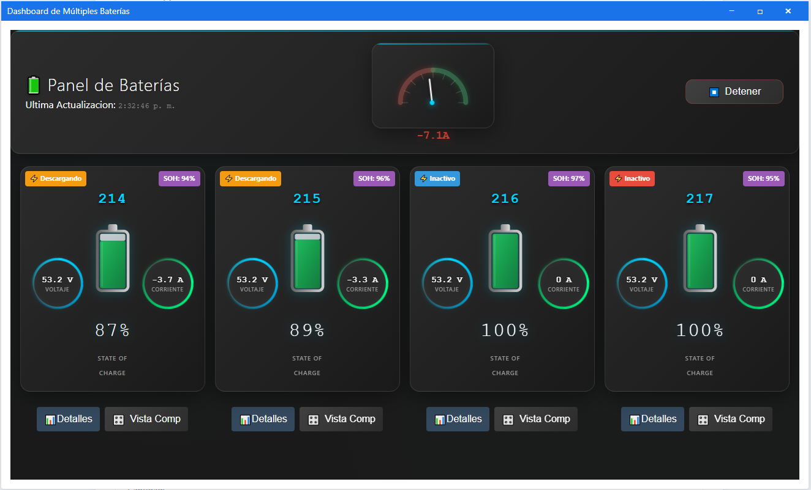
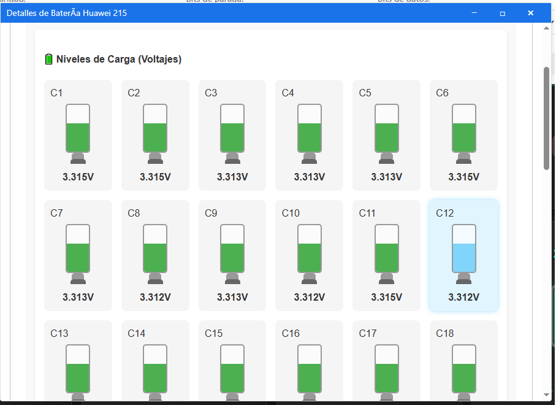

# Modbus Web UI para Baterías Huawei ESM-48150B1


## 🔋 Introducción

**Sistema avanzado de monitoreo y control para baterías Huawei ESM-48150B1** con protocolo Modbus RTU nativo. Este proyecto implementa un cliente Modbus personalizado que reemplaza PyModbus con una solución optimizada específicamente para baterías Huawei, incluyendo autenticación automática y soporte completo para funciones propietarias.
> **⚡ AUN EN FASE DE DESARROLLO ALGUNAS FUNCIONES ESTAN INCOMPLETAS.:** Version 0.5

> **⚡ Características Destacadas:** Monitoreo simultáneo de múltiples baterías, interfaz web moderna, protcolo Huawei nativo, sistema de diagnósticos avanzado y exportación de datos detallados.
 ## 📸 Vista del Sistema

<div align="center">
  <h3>Interfaz Principal de Monitoreo</h3>
  
  <p><i>Panel principal con dashboard de múltiples baterías en tiempo real</i></p>
</div>

<div align="center">
  <h3>Dashboard de Batería Individual</h3>
  
  <p><i>Vista detallada con datos de celdas, gráficos y diagnósticos</i></p>
</div>

<div align="center">
  <h3>Sistema de Diagnósticos Avanzados</h3>
  
  <p><i>Análisis completo de registros y exportación de datos</i></p>
</div>

## 🚀 Características Principales

### 🔌 Sistema de Comunicación Avanzado
- **Cliente Modbus Nativo**: Implementación personalizada en `core.py` que reemplaza PyModbus
- **Protocolo Huawei Optimizado**: Soporte completo para FC41 y secuencias de autenticación
- **Conexión Unificada**: Sistema simplificado de conexión única con gestión automática
- **Thread-Safe**: Operaciones concurrentes seguras para múltiples dispositivos

### 📊 Monitoreo Multi-Batería
- **Monitor Simultáneo**: Seguimiento en tiempo real de múltiples baterías Huawei
- **Sistema de Cache Inteligente**: Gestión optimizada de datos por dispositivo con `device_cache.py`
- **Historial Automático**: Grabación periódica de datos para análisis temporal
- **Datos de Celdas Individuales**: Monitoreo detallado de voltajes y temperaturas por celda

### 🎛️ Interfaz Web Moderna
- **Dashboard Industrial**: Vista unificada con gráficos en tiempo real
- **Sistema de Pestañas**: Organización modular de información (Estado, Celdas, Diagnósticos, Avanzado)
- **Diagnósticos Avanzados**: Visualización estructurada de todos los registros mapeados
- **Exportación de Datos**: Múltiples formatos (JSON, CSV, PDF)

### 🔧 Funcionalidades Técnicas
- **Detección Automática**: Identificación inteligente de baterías en la red
- **Gestión de Estados**: Control avanzado de conexión, autenticación y monitoreo
- **Sistema de Alertas**: Notificaciones automáticas por condiciones críticas
- **API REST Completa**: Endpoints para integración con sistemas externos

## 🎯 Dispositivos Compatibles

### Totalmente Soportado
- **Huawei ESM-48150B1** (ID típico: 217)
  - Autenticación automática
  - Lectura de información extendida (FC41)
  - Monitoreo de celdas individuales
  - Datos de fabricación y diagnóstico

### Soporte Básico
- **Dispositivos Modbus RTU genéricos**
  - Funciones estándar (FC01-FC06, FC15-FC16)
  - Sin autenticación ni funciones propietarias

## 🏗️ Arquitectura del Sistema

### Componentes Principales
```
modbus_app/
├── huawei_client/          # Cliente Modbus nativo
│   ├── core.py            # Cliente principal (reemplaza PyModbus)
│   ├── protocol.py        # Protocolo Modbus RTU
│   └── authentication.py  # Autenticación Huawei
├── battery_monitor.py     # Monitor multi-batería con threading
├── device_cache.py        # Sistema de cache inteligente
├── operations.py          # Mapeo de registros y operaciones
└── logger_config.py       # Configuración de logging
```

### Frontend Modular
```
static/js/
├── main.js                # Inicialización y coordinación
├── modbusApi.js          # API unificada del sistema
├── connectionHandler.js   # Gestión de conexión única
├── battery-components/    # Componentes modulares de batería
│   ├── tabs/             # Sistema de pestañas
│   └── charts/           # Gráficos y visualizaciones
└── vista-industrial/     # Estilos y componentes industriales
```

## 📚 Documentación Completa

Para obtener información detallada sobre cada aspecto del sistema, consulta las siguientes guías especializadas:

### 🚀 **Primeros Pasos**
- 🔧 [**Instalación y Configuración**](docs/INSTALACION.md) - Puesta en marcha paso a paso
- 🔌 [**Configuración de Hardware**](docs/CONFIGURACION_HARDWARE.md) - Adaptadores RS485 y conexiones físicas  
- ▶️ [**Guía de Uso**](docs/USO.md) - Manual completo de la interfaz web

### 🏗️ **Arquitectura y Funcionalidades**
- 🏛️ [**Arquitectura del Sistema**](docs/ARQUITECTURA_SISTEMA.md) - Cliente nativo vs PyModbus
- 🔋 [**Monitor de Baterías**](docs/MONITOR_BATERIAS.md) - Sistema multi-batería y threading
- 🔎 [**Detección de Dispositivos**](docs/DETECCION_DISPOSITIVOS.md) - Escaneo automático y configuración

### 🔧 **Configuración Avanzada**
- ⚙️ [**Configuración Avanzada**](docs/CONFIGURACION_AVANZADA.md) - Timeouts, optimización y parámetros expertos
- 🌐 [**API y Integración**](docs/API_REFERENCIA.md) - Documentación completa de endpoints
- 🔋 [**Protocolo Huawei**](docs/PROTOCOLO_HUAWEI.md) - Detalles técnicos de autenticación y FC41

### 🛠️ **Diagnósticos y Soporte**
- 🔍 [**Diagnósticos Avanzados**](docs/DIAGNOSTICOS_AVANZADOS.md) - Análisis de registros y datos de celdas
- ❓ [**Solución de Problemas**](docs/SOLUCION_PROBLEMAS.md) - Troubleshooting y errores comunes
- 🤝 [**Guía de Contribución**](docs/CONTRIBUCIONES.md) - Cómo colaborar con el proyecto

---

## 📋 Instalación Rápida

### Requisitos del Sistema
- **Python 3.10+** (recomendado 3.12+)
- **Puerto COM disponible** (USB-RS485 o virtual)
- **4GB RAM mínimo** (8GB recomendado)
- **Conexión a Internet** (para dependencias)

### Instalación Automática
```bash
# Clonar repositorio
git clone https://github.com/williamsioSapo/Huawei_Battery_monitor
cd Huawei_Battery_monitor

# Crear entorno virtual
python -m venv env

# Activar entorno (Windows)
.\env\Scripts\activate
# Activar entorno (Linux/macOS)
source env/bin/activate

# Instalar dependencias
pip install -r requirements.txt

# Ejecutar aplicación
python app.py
```

### Acceso a la Aplicación
- **URL Local**: `http://127.0.0.1:5000`
- **Red Local**: `http://[IP-del-servidor]:5000`

## 🔧 Configuración Rápida

### 1. Configuración Automática
Al ejecutar por primera vez, el sistema detectará automáticamente:
- Puertos COM disponibles
- Parámetros óptimos de comunicación
- Dispositivos conectados en la red

### 2. Parámetros Típicos para Huawei ESM-48150B1
```json
{
  "port": "COM8",           # ver en panel de control
  "baudrate": 9600,         # Estándar para Huawei
  "parity": "N",            # Sin paridad
  "stopbits": 1,            # 1 bit de parada
  "bytesize": 8,            # 8 bits de datos
  "timeout": 1,             # Timeout en segundos
  "slave_id": 217           # ID típico de Huawei ESM
}
```

## 📊 Uso del Sistema

### 🔌 Conexión Inicial
1. **Configurar Puerto**: Seleccionar puerto COM correcto
2. **Conectar Sistema**: Botón "Conectar al Sistema" 
3. **Inicializar Baterías**: Proceso automático de detección y autenticación
4. **Abrir Dashboard**: Acceso al panel de monitoreo principal

### 📈 Monitoreo en Tiempo Real
- **Dashboard Principal**: Vista general de todas las baterías
- **Datos por Celda**: Voltajes y temperaturas individuales
- **Gráficos Históricos**: Tendencias de voltaje, corriente y SOC
- **Alertas Automáticas**: Notificaciones por condiciones anómalas

### 🔧 Operaciones Avanzadas
- **Lectura de Registros**: Acceso directo a registros Modbus
- **Escritura de Parámetros**: Modificación controlada de configuraciones
- **Diagnósticos Completos**: Análisis exhaustivo del estado del sistema
- **Exportación de Datos**: Reportes en múltiples formatos

## 🛠️ Características Técnicas Avanzadas

### Cliente Modbus Personalizado
- **Eliminación de PyModbus**: Implementación nativa más eficiente
- **Timeouts Adaptativos**: Configuración automática según el tipo de operación
- **Reconexión Automática**: Recuperación ante pérdida de comunicación
- **Thread Safety**: Operaciones concurrentes seguras

### Sistema de Monitoreo
- **Polling Inteligente**: Frecuencia adaptativa según la actividad
- **Cache Multi-Nivel**: Optimización de acceso a datos frecuentes
- **Historial Persistente**: Almacenamiento automático para análisis
- **Detección de Anomalías**: Algoritmos de identificación de patrones inusuales

### API REST Nativa
```javascript
// Ejemplos de uso de la API
conectarSistema(parametros)           // Conexión única
inicializarBaterias()                 // Autenticación automática
getAvailableBatteries()              // Lista de baterías detectadas
startMultiBatteryMonitoring()        // Monitoreo simultáneo
getAllMappedRegisters(batteryId)     // Datos estructurados completos
```

## 📂 Estructura del Proyecto Actualizada

```
ModbusReader_SR/
├── app.py                     # Aplicación Flask principal
├── config.json               # Configuración centralizada
├── requirements.txt          # Dependencias Python
├── modbus_app/              # Módulo principal de la aplicación
│   ├── huawei_client/       # Cliente Modbus nativo
│   ├── battery_monitor.py   # Monitor multi-batería
│   ├── device_cache.py      # Sistema de cache
│   ├── operations.py        # Mapeo de registros
│   └── logger_config.py     # Configuración de logs
├── static/                  # Recursos web estáticos
│   ├── css/                # Estilos (incluyendo vista industrial)
│   ├── js/                 # JavaScript modular
│   └── images/             # Recursos gráficos
├── templates/              # Plantillas HTML
│   └── index.html         # Interfaz principal
└── docs/                   # Documentación detallada
    ├── INSTALACION.md      # Guía de instalación
    ├── CONFIGURACION_HARDWARE.md
    ├── USO.md              # Manual de usuario
    └── API_REFERENCIA.md   # Documentación de la API
```

## 🔍 Diagnósticos y Troubleshooting

### Herramientas de Diagnóstico Integradas
- **Monitor de Conexión**: Estado en tiempo real de la comunicación
- **Analizador de Registros**: Visualización estructurada de datos
- **Log del Sistema**: Registro detallado de operaciones
- **Test de Comunicación**: Verificación automática de conectividad

### Problemas Comunes y Soluciones

| Problema | Causa Probable | Solución |
|----------|----------------|----------|
| No detecta puerto COM | Driver USB-RS485 | Verificar en Administrador de Dispositivos |
| Timeout en comunicación | Parámetros serie incorrectos | Usar 9600-8N1 para Huawei |
| Fallo de autenticación | ID de esclavo incorrecto | Verificar ID 217 para ESM-48150B1 |
| Datos incompletos de celdas | Batería en modo ahorro | Despertar batería con operación inicial |

## 🚀 Mejoras desde la Versión Anterior

### ✅ Implementado
- ✨ **Cliente Modbus nativo** - Elimina dependencia de PyModbus
- 🔋 **Monitoreo multi-batería** - Soporte simultáneo para múltiples dispositivos  
- 🎛️ **Interfaz unificada** - Sistema de conexión simplificado
- 📊 **Diagnósticos avanzados** - Visualización estructurada completa
- 💾 **Cache inteligente** - Gestión optimizada de datos
- 🔄 **Threading seguro** - Operaciones concurrentes estables

### 🔄 En Desarrollo
- 📱 **App móvil** - Interface nativa para dispositivos móviles
- ☁️ **Integración cloud** - Sincronización con servicios externos
- 🤖 **IA predictiva** - Algoritmos de predicción de fallos
- 📈 **Analytics avanzado** - Métricas de rendimiento y eficiencia

## 🤝 Soporte y Comunidad

### Recursos de Ayuda
- 📖 **Documentación**: Carpeta `docs/` con guías detalladas
- 🐛 **Issues**: [GitHub Issues](https://github.com/nestorcal/ModbusReader_SR/issues)
- 💬 **Discusiones**: [GitHub Discussions](https://github.com/nestorcal/ModbusReader_SR/discussions)
- 📧 **Contacto**: [Información de contacto del proyecto]

### Contribuciones
Las contribuciones son bienvenidas! Ver [CONTRIBUCIONES.md](docs/CONTRIBUCIONES.md) para:
- 🔧 Nuevas características
- 🐛 Corrección de errores  
- 📚 Mejoras en documentación
- 🧪 Pruebas con nuevos dispositivos

## 📜 Licencia

Este proyecto está bajo la **Licencia BSD**. Consulta el archivo [LICENSE](LICENSE) para más detalles.

## 🙏 Agradecimientos

- **Comunidad PyModbus** - Base para el desarrollo inicial
- **Ingeniería Inversa** - Análisis del protocolo Huawei propietario
- **Contribuidores** - Pruebas, feedback y mejoras
- **Huawei** - Fabricante del hardware ESM-48150B1

---

> **⚠️ Descargo de Responsabilidad**: Este software es independiente y no está afiliado oficialmente con Huawei. Úsalo bajo tu propia responsabilidad en sistemas de producción.

**Última actualización**: Diciembre 2024 | **Versión**: 2.0-beta
